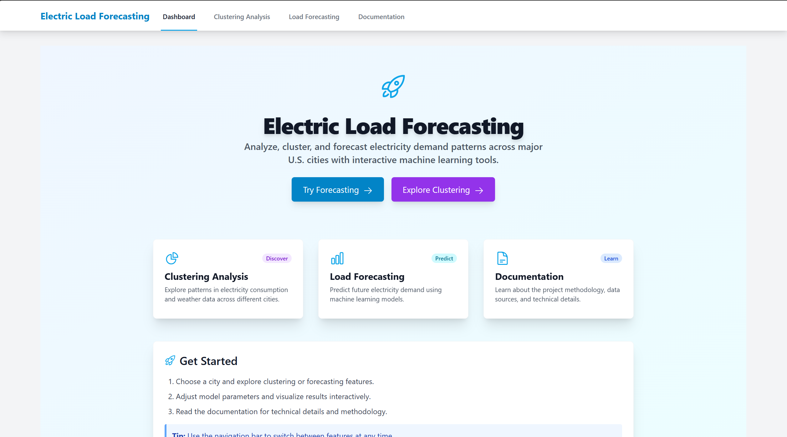
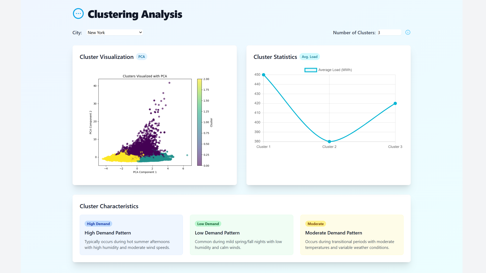
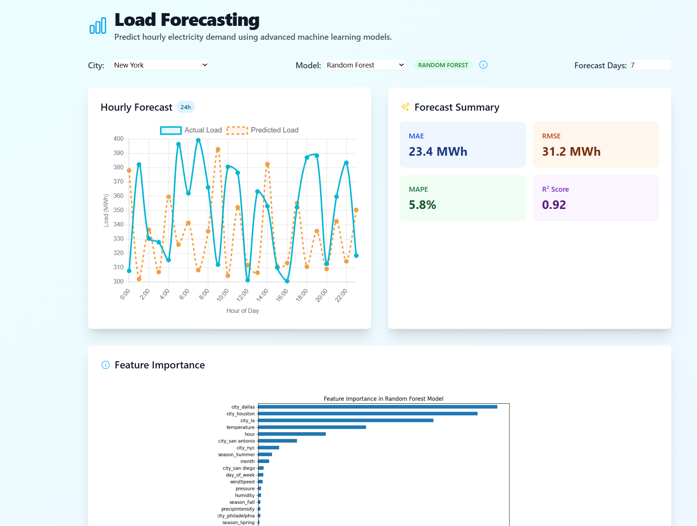
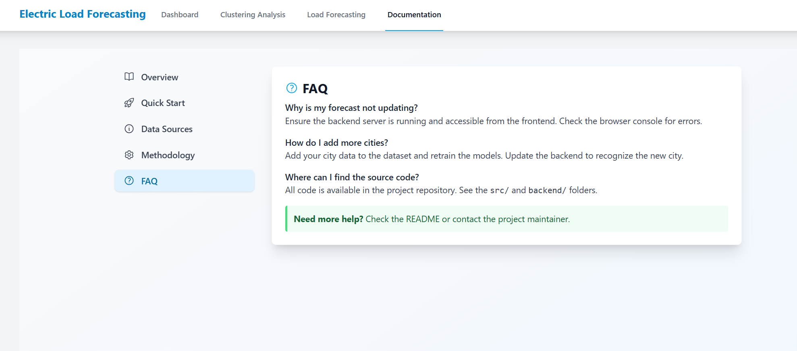

# Electric Load Forecasting Project

## Overview
This project implements an advanced electric load forecasting system using machine learning techniques. It combines preprocessing, clustering, and machine learning models to predict electrical load patterns and consumption.

## Screenshots

### Dashboard View

*Main dashboard showing load forecasting predictions and analytics*

### Clustering Analysis

*Visualization of load pattern clusters*

### Forecast Results

*Predicted vs actual load values*

### Documentation

*Project documentation and implementation details*

## Project Structure

### Preprocessing Module
Located in `/Preprocessing/`:
- `preprocessing1.ipynb`: Initial data cleaning and transformation
  - Data loading and validation
  - Missing value handling
  - Feature engineering
  - Basic statistical analysis
  
- `preprocessing2.ipynb`: Advanced data processing
  - Feature selection
  - Time series decomposition
  - Data normalization
  - Dataset preparation for modeling

- `Clustering&ML_Training.ipynb`: Model training and evaluation
  - Clustering analysis for load pattern identification
  - Random Forest model implementation
  - Model evaluation and validation
  - Performance metrics analysis

### Frontend Module
Located in `/frontend/`:
- React-based web interface
- Interactive visualizations
- Real-time prediction display
- User-friendly dashboard for data analysis

## Key Features
- Time series analysis of electrical load data
- Pattern recognition using clustering techniques
- Machine learning-based load prediction
- Interactive web interface for result visualization
- Scalable preprocessing pipeline

## Model Information
The following trained models are used in this project but not included in the repository due to size constraints:
- `rf_model.joblib`: Random Forest model for load prediction
- `kmeans.joblib`: K-means clustering model for pattern identification
- `pca.joblib`: PCA transformation model
- `scaler.joblib`: Data scaling model

## Getting Started

### Prerequisites
- Python 3.x
- Node.js and npm (for frontend)
- Required Python packages:
  ```
  numpy
  pandas
  scikit-learn
  joblib
  matplotlib
  seaborn
  ```

### Installation
1. Clone the repository:
   ```bash
   git clone https://github.com/Salman1205/Electric-load-forecasting.git
   cd Electric-load-forecasting
   ```

2. Set up the Python environment:
   ```bash
   pip install -r requirements.txt
   ```

3. Set up the frontend:
   ```bash
   cd frontend
   npm install
   npm start
   ```

### Usage
1. Run the preprocessing notebooks in sequence:
   - Start with `preprocessing1.ipynb`
   - Follow with `preprocessing2.ipynb`
   - Finally, run `Clustering&ML_Training.ipynb`

2. Access the web interface:
   - Launch the frontend application
   - Navigate to `http://localhost:3000`
   - Use the dashboard to visualize and analyze results

## Results and Visualizations
The project includes several visualization outputs:
- Cluster visualization plots
- Feature importance graphs
- Forecast accuracy plots
- Load pattern analysis charts

## Contributing
Contributions to improve the project are welcome. Please follow these steps:
1. Fork the repository
2. Create a feature branch
3. Commit your changes
4. Push to the branch
5. Create a Pull Request

## Contact
For access to the trained models or any queries, please contact:
- GitHub: [@Salman1205](https://github.com/Salman1205)

## License
This project is licensed under the MIT License - see the LICENSE file for details.

## Acknowledgments
- Thanks to all contributors who helped in developing this project
- Special thanks to the open-source community for providing essential tools and libraries 